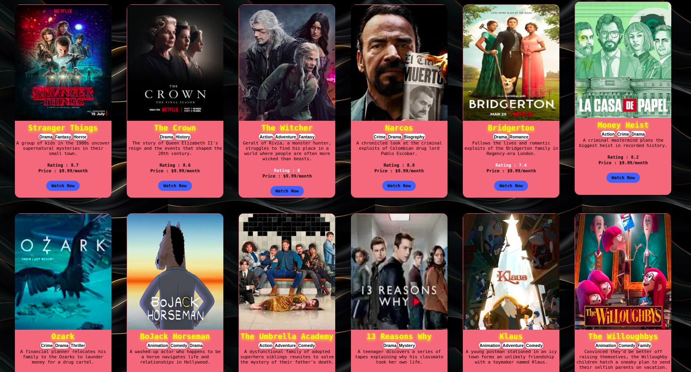

# Netflix-card
Trying to make a Netflix Card Project using React

You can run my project in Your Local Machine and plz give a feedback
``` bash
git clone https://github.com/Asikul001/Netflix-card.git
cd Netflix-card
npm install
npm run dev
```
open localhost in your browser at 5173 port Number
